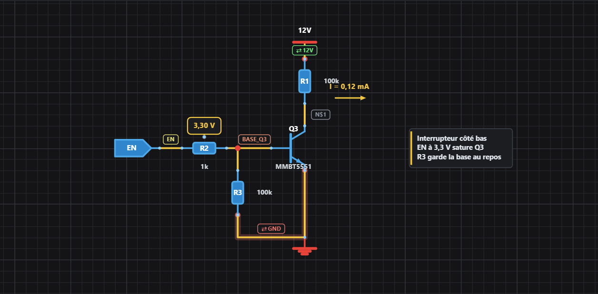
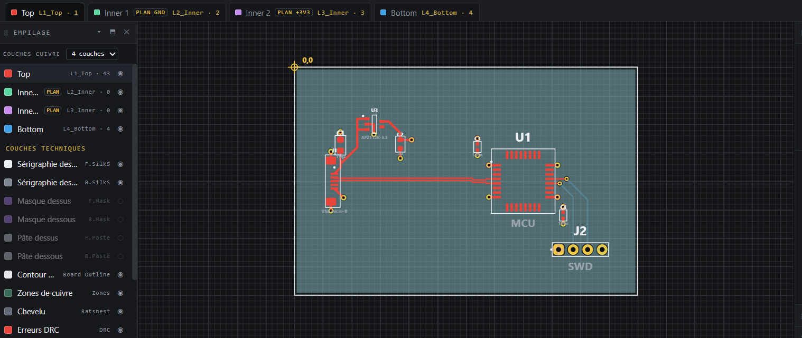

# WEB_CAO

**Suite de CAO électronique intégrée en HTML5 / JavaScript, 100% locale, sans compilation ni dépendance obligatoire.**

Du schéma au circuit imprimé jusqu'au dossier de fabrication industriel : saisissez vos schémas multi-feuilles, routez votre circuit avec poussée d'obstacles (*Push and Shove*), inspectez vos fichiers de fabrication IPC-2581 et analysez l'intégrité de vos signaux (impédance caractéristique, diaphonie spatialisée, chute de tension continue).

Les deux éditeurs fonctionnent immédiatement par simple double-clic dans votre navigateur (`file://`), sans aucun `npm install` ni serveur Node.js.

---

## Sommaire

- [⚡ Démarrage rapide](#-démarrage-rapide)
- [🛠️ Les 4 Outils de la suite](#️-les-4-outils-de-la-suite)
  - [Aperçu visuel](#aperçu-visuel)
- [🔄 Expérience unifiée & Flux de travail](#-expérience-unifiée--flux-de-travail)
- [📡 Simulation & Intégrité du Signal (SI / PI)](#-simulation--intégrité-du-signal-si--pi)
- [📂 Architecture du projet](#-architecture-du-projet)
- [📦 Dépendances](#-dépendances)
- [🧪 Bancs d'essai & Validation](#-bancs-dessai--validation)
- [📦 Version monofichier autonome](#-version-monofichier-autonome)
- [📄 Licence](#-licence)

---

## ⚡ Démarrage rapide

### 1. Utilisation directe (Navigateur seul)
Double-cliquez sur `index.html` (ou directement sur `editeur-pcb/editeur-pcb.html` / `editeur-schematique/editeur-schematique.html`).
- Fonctionne immédiatement en local (`file://`) dans tout navigateur moderne.
- Aucune installation requise pour concevoir, router et exporter vos fichiers (Gerber RS-274X, Excellon, BOM CSV, Netlist).

### 2. Avec le serveur local (Recommandé)
Le serveur Python standard fournit les services complémentaires (recherche de composants en ligne, parseur IPC-2581 et solveurs de simulation électromagnétique) :

```bash
python serveur.py
```

> [!TIP]
> **Sous Windows** : Un double-clic sur `serveur.py` ouvre la console et lance automatiquement votre navigateur à la bonne adresse.  
> **Sur réseau local / tablette** : Le serveur affiche l'adresse IP à ouvrir sur un autre appareil connecté au même réseau WiFi.

### 3. Sur iPad (avec Pyto)
`serveur.py` s'exécute nativement sous iOS avec l'application [Pyto](https://pyto.app/) (bibliothèque standard Python uniquement) :
- Ouvrez le dossier du dépôt dans Pyto (*Ouvrir dossier* pour autoriser l'accès au conteneur).
- Lancez :
```bash
python serveur.py --local --dossier ~/Documents/WEB_CAO
```
- Pyto ouvre l'interface dans son navigateur intégré ou dans Safari en mode *Split View*.

---

## 🛠️ Les 4 Outils de la suite

Chaque outil dispose de son propre `README.md` détaillant ses modules internes :

| Outil | Rôle & Fonctionnalités clés | Dépendance | Documentation |
| :--- | :--- | :---: | :--- |
| **Éditeur Schématique** | • Multi-feuilles et étiquettes globales<br>• Extraction de netlist automatique<br>• Boîtiers et nomenclature BOM (`.csv`)<br>• Recherche de références (`LIB_composants.csv`) | *Aucune* (navigateur seul) | [Guide Schématique](editeur-schematique/README.md) |
| **Éditeur PCB** | • Routage interactif avec poussée de cuivre (*Push & Shove*)<br>• Paires différentielles avec impédance ciblée<br>• Contrôle DRC temps réel avec figures cotées<br>• Exports Gerber RS-274X et Excellon par portée | *Aucune* (navigateur seul) | [Guide PCB](editeur-pcb/README.md) |
| **Recherche de Composants** | • Stocks et prix réels JLCPCB via [pcbparts.dev](https://pcbparts.dev/)<br>• Équivalences, brochages et cartes de référence<br>• Empreintes et symboles KiCad téléchargeables | `serveur.py` (passerelle MCP) | [Guide Composants](recherche-composants/README.md) |
| **Visionneuse IPC-2581** | • Import XML, ZIP ou CVG de fabrication<br>• Affichage couche par couche, netlist et composants<br>• Retournement de carte (`B`) et inspection électrique<br>• Export/réouverture en JSON autonome sans serveur | `serveur.py` (parseur Python) | [Guide IPC-2581](visionneuse-ipc2581/README.md) |

### Aperçu visuel

| Éditeur Schématique | Éditeur PCB |
| :---: | :---: |
|  |  |
| *Saisie intuitive, calculs de polarisation, sondes et étiquettes de nets* | *Routage multicouche, paires différentielles, empilage et contrôle DRC* |

---

## 🔄 Expérience unifiée & Flux de travail

Les 4 outils partagent une ergonomie cohérente et communiquent en temps réel sans nécessiter de base de données :

```
[ Éditeur Schématique ] <====== Cross-probing (Session & Phare) ======> [ Éditeur PCB ]
         |                                                                      |
         +------------------- [ Menu & Profils Utilisateur ] -------------------+
         |                                                                      |
[ Recherche Composants ] <==== Navigation fluide (sessionStorage) ====> [ Visionneuse IPC-2581 ]
```

### Cross-probing Schéma ↔ PCB
- **Saut direct avec phare de visibilité** : Cliquer sur *Éditeur PCB* depuis un composant sélectionné au schéma bascule automatiquement vers la carte et braque un **phare visuel** sur l'empreinte ciblée. Le saut inverse depuis une piste ou un net retrouve immédiatement le composant au schéma.
- **Deux onglets côte à côte (`BroadcastChannel`)** : Avec le schéma dans une fenêtre et le PCB dans l'autre, la touche **`L`** (*Montrer*) synchronise instantanément la sélection d'un écran sur l'autre sans changer de page.

### Mémoire de session & Profils (`sessionStorage`)
- Le travail non enregistré suit l'utilisateur lors du passage d'une page à l'autre via `sessionStorage` : composants, pistes posées, réglages de vue et requêtes en cours sont restaurés instantanément.
- Le bouton utilisateur `👤` gère des profils distincts (`profils/<nom>.json`) : disposition des panneaux dockables/flottants, pas de grille, contraste et préférences d'affichage.

### Outils partagés
- **Recherche universelle (`Ctrl+F`)** : Recherche instantanée de repères (`R1`, `C12`) ou de nets. Au schéma, la recherche traverse toutes les feuilles et bascule automatiquement sur la bonne vue.
- **Mesure de cotes (`K`)** : Mesure rapide de distance avec affichage direct de ΔX, ΔY et de l'angle. Au PCB, la mesure s'aimante sur les centres de pastilles, vias et pistes de fabrication.

---

## 📡 Simulation & Intégrité du Signal (SI / PI)

Le bouton **« Simulation EM… »** (disponible dans l'Éditeur PCB et dans la Visionneuse IPC-2581) ouvre un panneau d'analyse intégré articulé autour de **4 onglets d'interface utilisateur** reposant sur **4 moteurs Python spécialisés** et **5 chaînes de calcul physiques** :

### 1. Organisation des analyses
- **Onglet Impédance & Z différentielle (SI)** : Résolution par la **Méthode des Moments (MoM 2D)** sur la section droite réelle de chaque tronçon (`ligne_mom.py` v2.5.0 via `simulation_em.py` v4.1.0). Carte de chaleur peinte sur le cuivre (Bleu = conforme, Rouge = trop élevée, Vert = trop faible), calcul des pertes ohmiques/diélectriques et des modes pair/impair.
- **Onglet Crosstalk spatialisé (SI)** : Moteur dédié (`crosstalk.py` v3.1.0). Réflectométrie temporelle synthétisée à partir de la géométrie du routage (cascade multi-ports $S$, IFFT). Elle indique **où** le couplage se produit le long de la piste (NEXT et FEXT), en pourcentage et **en millivolts réels** face au budget de bruit du récepteur, en regard du profil d'espacement et des défauts de plan (fentes, pas de couture).
- **Onglet Current Return Path & PDN (SI/PI)** : Analyse hybride du retour de courant et de l'intégrité de puissance (`ligne_mom.py` + `simulation_em.py`). Inductance de boucle de retour (formules partielles de Grover), impédance de traversée de plans et résonance de cavité PDN (Bogatin), et résonance quart d'onde des moignons de vias (stubs).
- **Onglet Chute continue DC & Thermique (PI)** : Résolution résistive sans EM par maillage surfacique 2D et gradient conjugué Jacobi (`dc_solver.py` v2.1.0). Cartographie du potentiel et de la densité de courant, détail de résistance via par via, et double modèle thermique : **étalement physique volumique** (conduction stratifié + plans, validé IPC-2152) et **référence normative comparative IPC-2221** (conducteur isolé).

> [!NOTE]
> 📖 **Documentation approfondie disponible** :  
> Pour consulter l'ensemble des fondements physiques, équations, étalons de validation analytiques et choix algorithmiques, consultez le fichier [simulations-si-pi.json](simulations-si-pi.json) ainsi que le [Guide complet de Simulation EM & Crosstalk](docs/simulation-em.md).

---

## 📂 Architecture du projet

```
WEB_CAO/
├── index.html                     Page d'accueil : sélection de l'outil et profil
├── serveur.py                     Serveur local HTTP & passerelle API (bibliothèque standard)
│
├── editeur-schematique/           Saisie schématique, multi-feuilles, extraction netlist
├── editeur-pcb/                   Routage PCB, moteur PNS, empilage, DRC, export Gerber
├── recherche-composants/          Recherche pcbparts.dev (stock JLCPCB, équivalences)
├── visionneuse-ipc2581/           Inspection de fichiers de fabrication IPC-2581
│
├── commun/                        Code partagé (UI, session, repérage, simulation-em)
│   ├── workspace.js / .css        Gestionnaire de panneaux dockables et flottants
│   ├── session.js / .css          Persistance du travail entre outils (sessionStorage)
│   ├── profils.js / .css          Gestion des préférences utilisateurs
│   ├── reperage.js / .css         Recherche rapide (Ctrl+F) et mesure de cotes (K)
│   └── simulation-em.js / .css    Panneau unifié de simulation SI / PI
│
├── python/                        Modules de calcul et passerelles (côté serveur)
│   ├── passerelle_mcp.py          Client MCP pour pcbparts.dev
│   ├── ipc2581_parser.py          Parseur XML IPC-2581 -> JSON
│   ├── ligne_mom.py               Solveur d'impédance 2D par Méthode des Moments (MoM)
│   ├── crosstalk.py               Synthèse de paramètres S et réflectométrie de couplage
│   ├── dc_solver.py               Solveur de chute DC et échauffement thermique
│   └── test/                      Suites de tests de validation unitaire
│
├── docs/                          Documentations techniques détaillées
│   └── simulation-em.md           Traité théorique et algorithmique de simulation EM
│
├── screen/                        Captures d'écran des éditeurs
│   ├── sch.png                    Aperçu de l'Éditeur Schématique
│   └── pcb.png                    Aperçu de l'Éditeur PCB
│
├── profils/                       Profils utilisateurs sauvegardés (ex: Pilou.json)
├── LIB_composants.csv             Bibliothèque locale de références (optionnelle)
└── requirements.txt               Fichier explicatif des garanties sans dépendance
```

---

## 📦 Dépendances

Le projet est conçu selon une règle stricte : **zéro dépendance externe obligatoire**.

- **Navigateur** : JavaScript standard (ES6), aucun transpilateur, aucun bundler obligatoire, aucun paquet npm requis pour l'exécution.
- **Serveur Python (`serveur.py`)** : Fonctionne avec la bibliothèque standard Python (testé sur Python 3.10 à 3.12).

### Dépendances facultatives (Solveurs avancés)
Seuls les calculs de simulation électromagnétique et de chute continue utilisent des bibliothèques scientifiques :
- **numpy** : requis uniquement pour le solveur d'impédance MoM (`python/ligne_mom.py`) et le crosstalk (`python/crosstalk.py`).
- **scipy** : requis uniquement pour le gradient conjugué du solveur DC (`python/dc_solver.py`) et les intégrales elliptiques des bancs d'essai.

```bash
pip install numpy scipy
```

Sans ces deux paquets, l'ensemble des 4 outils fonctionne normalement ; seules les requêtes de simulation numérique indiquent la commande d'installation nécessaire.

---

## 🧪 Bancs d'essai & Validation

Les bancs d'essai s'exécutent en ligne de commande (Node.js et Python suffisent) :

| Composant testé | Commande d'exécution | Couverture |
| :--- | :--- | :--- |
| **Éditeur PCB** | `python editeur-pcb/outils/build-monofichier.py && node editeur-pcb/test/harness.js` | DRC, netlist, tracé, paires diff, Gerber, Excellon, PNS |
| **Éditeur Schématique** | `python editeur-schematique/outils/build-monofichier.py && node editeur-schematique/test/harness.js` | Connectivité, extraction des nets, multi-feuilles, nomenclature |
| **Visionneuse IPC-2581** | `python visionneuse-ipc2581/test/banc-essai.py`<br>`node visionneuse-ipc2581/test/harness-sim.js` | Parseur XML, conformité du modèle JSON, mesure de blindage |
| **Solveur MoM ($Z_0$)** | `python python/test/banc-ligne-mom.py` | 170 cas validés contre étalons analytiques (Hammerstad-Jensen, Wen...) |
| **Solveur Crosstalk** | `python python/test/banc-crosstalk.py` | 45 cas : conservation de l'énergie, cascade, localisation spatiale |
| **Solveur Chute DC** | `python python/test/banc-dc.py` | 42 cas validés contre résistivité théorique, vias et double modèle thermique |

---

## 📦 Version monofichier autonome

Chaque éditeur peut être assemblé en un fichier HTML unique intégrant l'ensemble de ses scripts et styles, pratique pour l'archivage ou l'envoi par courriel :

```bash
# Génère dist/editeur-pcb.html
python editeur-pcb/outils/build-monofichier.py

# Génère dist/editeur-schematique.html
python editeur-schematique/outils/build-monofichier.py
```

---

## 📄 Licence

Ce projet est distribué sous licence MIT. Consultez le fichier [LICENSE](LICENSE) pour plus de détails.
