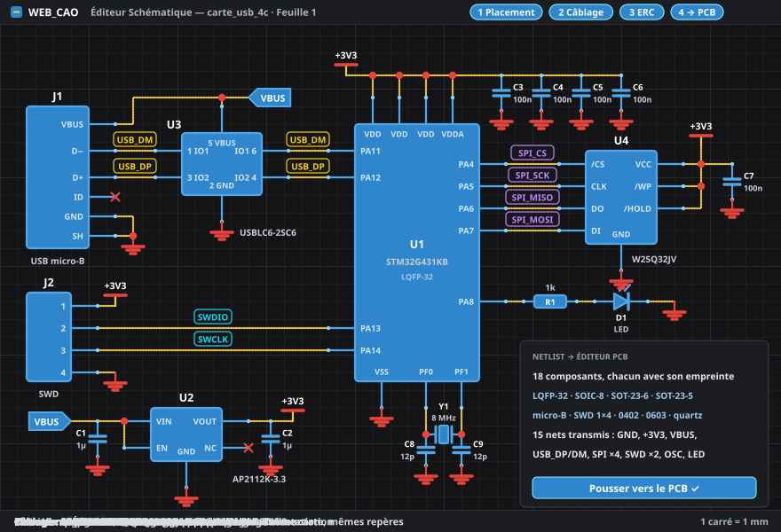
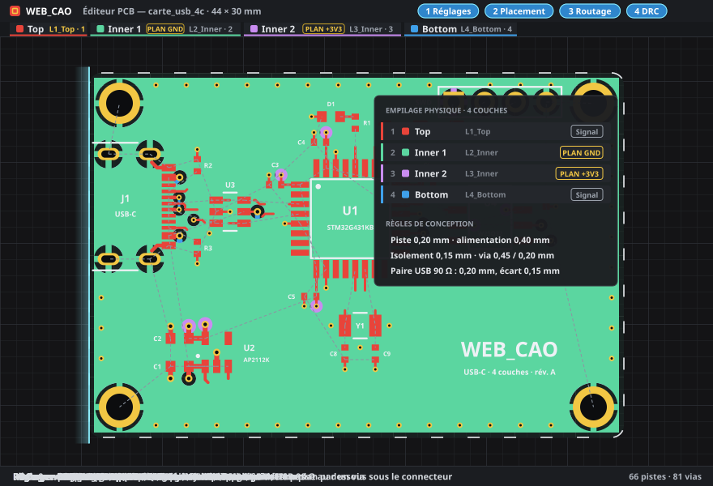

# WEB_CAO

**Suite de CAO électronique en HTML5 / JavaScript, 100 % locale, sans compilation ni dépendance obligatoire.**

Du schéma au dossier de fabrication : saisie multi-feuilles, routage *Push & Shove*, bibliothèque de composants, inspection de fichiers IPC-2581 et simulation d'intégrité du signal et de l'alimentation (SI / PI / RF). Un assistant IA optionnel lit vos datasheets et propose les réglages de simulation, avec la page et la citation d'où ils viennent.

Les éditeurs s'ouvrent par simple double-clic dans le navigateur, sans `npm install` ni serveur.

<p align="center">
  
</p>
<p align="center">
  
</p>
<p align="center"><sub>Une carte USB du schéma au PCB 4 couches · versions GIF : <a href="screen/schematique-carte-usb.gif">schéma</a>, <a href="screen/pcb-4-couches.gif">PCB</a></sub></p>

---

## ⚡ Démarrage rapide

**Sans rien installer** : ouvrez `index.html` dans un navigateur récent. Schéma, routage et exports de fabrication fonctionnent tels quels.

**Avec le serveur local** (recommandé, Python 3 standard) : il ajoute la recherche de composants en ligne, le parseur IPC-2581, les solveurs de simulation, les dossiers de projet sur disque et la bibliothèque centrale.

```bash
python web_CAO.py
```

Le navigateur s'ouvre à la bonne adresse. Sous Windows, un double-clic sur `web_CAO.py` (ou `demarrer_WEB_CAO.cmd`) suffit. Au démarrage, le serveur se met à jour depuis GitHub (`--sans-maj` pour s'en passer).

Pour les simulations numériques, ajoutez numpy et scipy : `pip install -r requirements.txt`.

## 💻 Sur quels appareils ?

WEB_CAO tourne dans n'importe quel navigateur récent ; seul le serveur demande Python.

| Appareil | Comment l'utiliser |
| :--- | :--- |
| **Ordinateur** (Windows, macOS, Linux) | Navigateur seul, ou serveur local sur la même machine : c'est le mode complet. |
| **Tablette, téléphone, écran tactile** | Ouvrir l'adresse affichée par un serveur lancé ailleurs sur le réseau, ou lancer le serveur sur l'appareil lui-même s'il exécute Python (par ex. [Pyto](https://pyto.app/) sur iPhone / iPad : `python web_CAO.py --local --dossier <dossier>`). Activez le **mode tactile** depuis l'accueil. |
| **Raspberry Pi, serveur sans écran** | Le serveur détecte l'absence d'affichage et n'ouvre pas de navigateur ; on s'y connecte depuis un autre appareil du réseau. |

**Mode tactile** : pincement pour zoomer, deux doigts pour se déplacer, stylet reconnu (la paume est ignorée). Un appui long ouvre une **roulette de commandes** adaptée à ce qui est touché (composant, piste, vide…), personnalisable et gardée dans le profil ; le bouton **Roulette**, à côté de **Tactile**, l'ouvre aussi sans appui long, même à la souris.

> [!NOTE]
> Lancé **depuis un terminal**, le serveur écoute sur tout le réseau. Par prudence (pas de mot de passe), les dossiers de projet y sont alors refusés et la bibliothèque passe en lecture seule, sauf avec `--projets-reseau` sur un réseau de confiance. Lancé par double-clic ou avec `--local`, il n'écoute que la machine elle-même et tout est permis.

---

## 🛠️ Les outils

| Outil | Rôle | Serveur | Guide |
| :--- | :--- | :---: | :--- |
| **Éditeur Schématique** | Multi-feuilles, bus et hiérarchie, netlist et BOM enrichies, variantes de montage (composants non montés), reconnaissance de motifs (LDO, buck, I2C/SPI/UART…) | Non | [Guide](editeur-schematique/README.md) |
| **Éditeur PCB** | Routage *Push & Shove*, paires différentielles, vias borgnes/enterrés, DRC temps réel, profils fabricants, placement assisté, synchro schéma → PCB | Non¹ | [Guide](editeur-pcb/README.md) |
| **Gestion LIB** | Catalogue `LIB_composants.csv`, éditeurs d'empreintes et de symboles, modèles SPICE, import JLCPCB / LCSC | Oui | — |
| **Recherche de composants** | Stocks et prix JLCPCB via [pcbparts.dev](https://pcbparts.dev/), équivalences, empreintes KiCad, datasheets | Oui | [Guide](recherche-composants/README.md) |
| **Visionneuse IPC-2581** | Carte livrée par le fabricant : couches, empilage, nets, mesures et simulation SI/PI | Oui | [Guide](visionneuse-ipc2581/README.md) |

¹ La simulation, elle, passe par le serveur.

**Dossier de fabrication** (`fabrication.zip`) : Gerber RS-274X, Excellon par portée de perçage, IPC-D-356, BOM, positions et Master Drawing PDF.

**Entre les outils** : un projet commun sur disque (`projet.cao.json`, documents, `datasheets/`), cross-probing schéma ↔ PCB (touche `L` entre deux onglets), travail en cours qui suit d'un outil à l'autre, profils utilisateur (panneaux, grille, préférences), recherche `Ctrl+F` et mesure `K`.

**Bibliothèque centrale** : un dossier local, réseau ou synchronisé (`--lib` ou page d'accueil). Par défaut `LIB/` à côté de l'outil, sinon `../PROJETS/LIB_CAO` ([WEB_SUITE_PROJETS](https://github.com/pilou33620/WEB_SUITE_PROJETS)).

---

## 📡 Simulation SI / PI

Le bouton **« Simulation EM… »** de l'Éditeur PCB et de la Visionneuse ouvre un panneau unique ; les résultats sont peints sur la carte.

| Famille | Analyses |
| :--- | :--- |
| **Signal (SI)** | Impédance Z₀ (méthode des moments 2D), Z différentielle et paramètres S, crosstalk niveau 2 (k_total, NEXT/FEXT normalisés, statut vert/orange/rouge, par piste ou sur toute la carte), chemin de retour, *setup & hold* d'un bus synchrone, **diagramme de l'œil** (PRBS et pire cas) avec les gabarits USB, PCIe, HDMI, LVDS, MIPI, SATA, SGMII, SPI, QSPI, SD et eMMC |
| **Alimentation (PI)** | Chute DC et échauffement, impédance du PDN Z(ω) avec condensateurs réels et résonances de cavité |
| **RF** | S₂₁ d'un réseau d'adaptation entre ports d'impédance complexe, abaque de Smith, « et si » par composant |
| **Audit** | Vérification de toute la carte, tous les nets, règle par règle ([mode d'emploi](docs/verification-carte.md)) |

Physique, équations et étalons de validation : [Guide Simulation EM](docs/simulation-em.md).

## 🤖 Assistant IA

Volet présent dans tous les outils, branché sur **Google AI Studio** (Gemma 4 31B par défaut, Gemini 3.8 Flash). Il connaît l'état du schéma ou de la carte, accepte une datasheet en PDF ou en capture, et peut **paramétrer les simulations depuis la datasheet** : chaque valeur est bornée, sourcée, et appliquée seulement si vous la cochez.

La clé API reste en mémoire vive, ou est fournie par le serveur (`GEMINI_API_KEY`, ou `api_key_free_ia_studio.txt` ignoré par Git). Les pièces jointes partent chez Google avec le message.

---

## 🖥️ Options du serveur

<details>
<summary><code>python web_CAO.py [options]</code></summary>

| Option | Effet |
| :--- | :--- |
| `--port N` | Port d'écoute (défaut 8000, repli automatique 8001–8020) |
| `--local` | N'écoute que la machine elle-même : projets, écriture de la LIB et clé IA autorisés |
| `--host ADR` | Adresse d'écoute explicite |
| `--navigateur` / `--sans-navigateur` | Force l'ouverture ou non du navigateur |
| `--sans-pause` | Rend la main sans attendre Entrée (Windows) |
| `--sans-maj` | Pas de mise à jour depuis GitHub |
| `--dossier DIR` | Dossier servi |
| `--projets DIR` | Racine(s) des dossiers de projet, répétable |
| `--projets-reseau` | En écoute réseau, ouvre quand même les projets et l'écriture dans la LIB (réseau de confiance uniquement) |
| `--lib DIR` | Dossier de la bibliothèque centrale |

Lancé par [WEB·SUITE](https://github.com/pilou33620/WEB_SUITE), WEB_CAO n'enregistre que dans le dossier du projet, sous `PROJETS/CAO`, et sépare deux gestes :

- **Enregistrer** (`Ctrl+S`, menu Fichier ou roulette tactile) et **Exporter vers le PCB** (bouton **⇉ PCB** du schéma) écrivent **en local**, sans rien envoyer sur GitHub. L'export écrit le schéma, ouvre l'Éditeur PCB, y applique la netlist (empreintes nouvelles, boîtiers changés, valeurs, nets ; placement et routage gardés) et écrit la carte : de quoi faire une retouche de dernière minute sans commit ;
- **☁ Sauvegarder le projet → GitHub** (`Ctrl+Maj+S`, menu Fichier) enregistre le document ouvert puis le lanceur envoie tout le projet sur GitHub en un seul commit (commit + push).

La visionneuse IPC-2581 enregistre sa carte puis l'envoie directement. La Gestion LIB fait de même avec `PROJETS/LIB_CAO` : chaque enregistrement (catalogue, empreinte, symbole, suppression) part sur GitHub, et la LIB ne se déplace plus depuis l'accueil. Pas de téléchargement, ni de dossier pris ailleurs : sans projet ouvert, l'éditeur demande dans quel projet ranger le document (existant ou nouveau). Cela vaut sur le PC du lanceur comme depuis une tablette reliée à un Raspberry Pi (voir le README de WEB·SUITE pour le jeton du mode réseau).

</details>

## 📂 Organisation du dépôt

```
index.html               Accueil : outils, projet, bibliothèque, profil, mode tactile
web_CAO.py               Serveur local et API (bibliothèque standard Python)
editeur-schematique/     editeur-pcb/     gestion-lib/
recherche-composants/    visionneuse-ipc2581/
commun/                  Code partagé : panneaux, projets, profils, tactile, variantes de montage, IA, simulation
python/                  Solveurs (MoM, diaphonie, DC, RF), parseur IPC-2581, bancs d'essai
profils/                 Profils utilisateurs et fabricants
docs/                    Guides de simulation et historique de développement
screen/                  Captures et animations
```

## 🧪 Tests

Zéro dépendance obligatoire : JavaScript standard côté navigateur, bibliothèque standard Python côté serveur (3.10 – 3.12). Tous les bancs tournent en CI (`.github/workflows/ci.yml`).

<details>
<summary>Lancer les bancs en local</summary>

```bash
node editeur-pcb/test/harness.js
node editeur-schematique/test/harness.js
node visionneuse-ipc2581/test/harness-sim.js
node gestion-lib/test/banc-catalogue.js
python python/test/banc-ligne-mom.py      # et les autres banc-*.py de python/test/
```

Les bancs lisent la LIB à son emplacement par défaut (`../PROJETS/LIB_CAO`).

</details>

> [!IMPORTANT]
> `dist/` n'est pas versionné. Après une modification de `js/`, régénérez le monofichier de l'éditeur (`python editeur-pcb/outils/build-monofichier.py`, idem pour le schématique) : c'est lui qu'on ouvre en double-clic ou qu'on envoie par courriel.

## 🗺️ Feuille de route

Backlog dans [A-FAIRE.md](A-FAIRE.md) ; limites connues dans chaque guide d'outil.

## 📄 Licence

MIT, voir [LICENSE](LICENSE).
