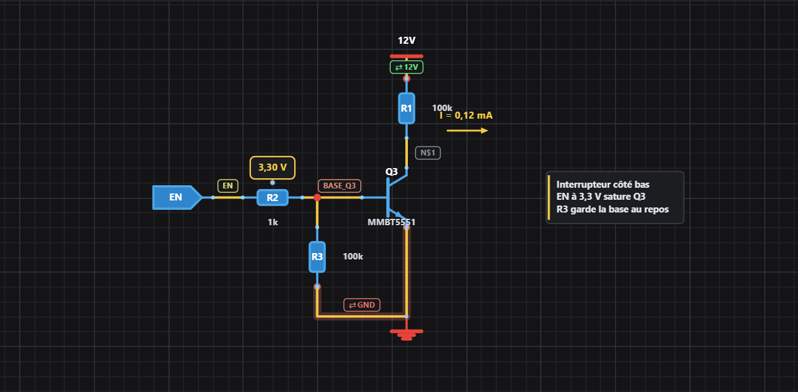
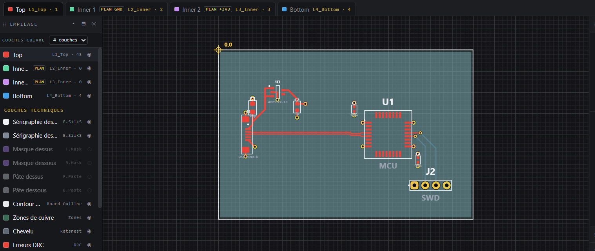

# WEB_CAO

**Suite de CAO électronique intégrée en HTML5 / JavaScript, 100 % locale, sans compilation ni dépendance obligatoire.**

Du schéma au circuit imprimé jusqu'au dossier de fabrication industriel : saisissez vos schémas multi-feuilles, routez votre carte avec poussée d'obstacles (*Push and Shove*), gérez votre bibliothèque de composants, inspectez les fichiers IPC-2581 livrés par un fabricant et analysez l'intégrité du signal et de l'alimentation (impédance, diaphonie localisée, chemin de retour, bus synchrones, chute DC, impédance du PDN). Un assistant IA optionnel lit vos datasheets et propose les réglages de simulation, valeur par valeur, avec la page et la citation d'où elles viennent.

Les deux éditeurs fonctionnent immédiatement par simple double-clic dans le navigateur (`file://`), sans `npm install` ni serveur Node.js.

---

## Sommaire

- [⚡ Démarrage rapide](#-démarrage-rapide)
- [🛠️ Les 5 outils de la suite](#️-les-5-outils-de-la-suite)
- [✏️ Éditeur Schématique](#️-éditeur-schématique)
- [🟩 Éditeur PCB](#-éditeur-pcb)
- [📚 Gestion LIB & bibliothèque centrale](#-gestion-lib--bibliothèque-centrale)
- [🔎 Recherche de composants](#-recherche-de-composants)
- [🏭 Visionneuse IPC-2581](#-visionneuse-ipc-2581)
- [📡 Simulation SI / PI](#-simulation-si--pi)
- [🤖 Assistant IA](#-assistant-ia)
- [🔄 Expérience unifiée : projets, profils, cross-probing](#-expérience-unifiée--projets-profils-cross-probing)
- [🖥️ Le serveur `web_CAO.py`](#️-le-serveur-web_caopy)
- [📂 Architecture du projet](#-architecture-du-projet)
- [📦 Dépendances](#-dépendances)
- [🧪 Bancs d'essai & validation](#-bancs-dessai--validation)
- [📦 Version monofichier autonome](#-version-monofichier-autonome)
- [🗺️ Limites & feuille de route](#️-limites--feuille-de-route)
- [📄 Licence](#-licence)

---

## ⚡ Démarrage rapide

### 1. Navigateur seul
Double-cliquez sur `index.html` (ou directement sur `editeur-pcb/editeur-pcb.html` / `editeur-schematique/editeur-schematique.html`).
- Fonctionne en local (`file://`) dans tout navigateur moderne.
- Aucune installation pour concevoir, router et exporter (Gerber RS-274X, Excellon, IPC-D-356, BOM, positions, Master Drawing PDF, netlist).

### 2. Avec le serveur local (recommandé)
Le serveur Python (bibliothèque standard) ajoute la recherche de composants en ligne, le parseur IPC-2581, les solveurs de simulation, les dossiers de projet sur disque, la bibliothèque centrale et l'enregistrement des profils :

```bash
python web_CAO.py
```

> [!TIP]
> **Sous Windows** : un double-clic sur `web_CAO.py` (ou sur `demarrer_WEB_CAO.cmd`, qui garde la fenêtre ouverte si Python échoue à démarrer) ouvre la console et le navigateur à la bonne adresse. Le double-clic démarre **en mode local**, dossiers de projet compris : c'est le seul mode où l'outil est entier.
> **Sur réseau local / tablette** : lancé **depuis un terminal**, le serveur écoute sur tout le réseau et affiche l'adresse IP à ouvrir sur la tablette. Les dossiers de projet restent refusés dans ce mode (sauf `--projets-reseau`, voir plus bas), la bibliothèque centrale passe en **lecture seule** (catalogue, empreintes et symboles se lisent, rien ne s'écrit ni ne se déplace) et la clé IA locale n'est pas partagée : un accès disque sans mot de passe ne s'ouvre pas à un réseau.
> **Si le port est refusé** (`WinError 10013` sur certains postes d'entreprise) : le serveur prend le premier port libre de 8001 à 8020. L'adresse reste stable d'un lancement à l'autre, ce qui préserve réglages et profils (rangés par origine dans le navigateur).
> **Mises à jour** : au démarrage, le serveur vérifie le dépôt GitHub, applique la mise à jour et redémarre de lui-même (`--sans-maj` pour s'en passer).

### 3. Sur iPad (avec Pyto)
`web_CAO.py` s'exécute sous iOS avec [Pyto](https://pyto.app/) (bibliothèque standard uniquement) :
```bash
python web_CAO.py --local --dossier ~/Documents/WEB_CAO
```
Activez ensuite le **mode tactile** depuis la page d'accueil (pincement, déplacement à deux doigts, Apple Pencil, barre d'actions sous le pouce).

### 4. Raspberry Pi / terminal sans écran
Le serveur détecte l'absence d'affichage et n'ouvre pas de navigateur ; connectez-vous depuis un autre poste du réseau (`--navigateur` / `--sans-navigateur` pour forcer).

---

## 🛠️ Les 5 outils de la suite

| Outil | Rôle | Serveur requis | Documentation |
| :--- | :--- | :---: | :--- |
| **Éditeur Schématique** | Saisie multi-feuilles, bus et hiérarchie, netlist, BOM, reconnaissance de motifs | Non | [Guide Schématique](editeur-schematique/README.md) |
| **Éditeur PCB** | Placement, routage *Push & Shove*, paires différentielles, DRC, fabrication, simulation SI/PI | Non (simulation : oui) | [Guide PCB](editeur-pcb/README.md) |
| **Gestion LIB** | Catalogue `LIB_composants.csv`, éditeurs d'empreintes et de symboles, modèles SPICE, import JLCPCB/LCSC | Oui | — |
| **Recherche de composants** | Stocks et prix JLCPCB via [pcbparts.dev](https://pcbparts.dev/), équivalences, empreintes KiCad | Oui (passerelle MCP) | [Guide Composants](recherche-composants/README.md) |
| **Visionneuse IPC-2581** | Carte livrée par le fabricant : couches, empilage, nets, composants, simulation SI/PI | Oui (parseur Python) | [Guide IPC-2581](visionneuse-ipc2581/README.md) |

### Aperçu visuel

| Éditeur Schématique | Éditeur PCB |
| :---: | :---: |
|  |  |
| *Saisie, calculs de polarisation, sondes et étiquettes de nets* | *Routage multicouche, paires différentielles, empilage et DRC* |

---

## ✏️ Éditeur Schématique

- **Multi-feuilles et hiérarchie** : étiquettes globales, sous-feuilles avec *sheet pins*, feuille racine synoptique traçant automatiquement les bus et faisceaux inter-blocs.
- **Bus** : notation vectorielle (`D[0..7]`, `SPI{…}`), piquage interactif avec auto-incrémentation du signal suivant, isolation électrique du tronc.
- **Bibliothèque** : explorateur visuel pop-up (symbole + empreinte en double aperçu), 39 symboles de base, recherche dans `LIB_composants.csv` avec préfixe, valeur et brochage affectés automatiquement ; le boîtier choisi au schéma décide de l'empreinte au PCB.
- **Netlist & BOM enrichies** : réconciliation avec le catalogue (empreinte, MPN, fabricant, références LCSC / Mouser / DigiKey).
- **Reconnaissance de motifs** : régulateurs (LDO, 78xx/79xx, buck), bus I2C / SPI / UART, quartz, filtres RC ; suggestion de classes de nets et inférence des courants DC transmis à la simulation.
- **Recherche de composants intégrée** et **cross-probing** vers le PCB.

## 🟩 Éditeur PCB

- **Routage interactif** : moteur *Push & Shove* (enveloppes, index spatial, optimiseur), L chanfreiné, pistes en arc de cercle, serpentins d'appariement de longueur (*meanders*), adoucissement des angles droits.
- **Paires différentielles** : déclaration, règle à six cotes, tracé couplé, vias en éventail, impédance différentielle ciblée, contrôle de longueur découplée.
- **Empilage physique** : vias traversants, borgnes et enterrés ; un fichier de perçage par portée.
- **Règles de conception & DRC temps réel** avec figures cotées, matrice des natures de cuivre, classes de nets ; **profils fabricants** (JLCPCB, PCBWay, Eurocircuits, générique) avec audit de conformité et application automatique des règles.
- **Empreintes** : bibliothèque de 96 boîtiers (CMS passifs, SOIC/TSSOP/QFN/BGA, TO, USB-C…), pastilles de formes arbitraires (polygone, chanfrein, découpes thermiques), dessin d'empreinte à la main, réaffectation sans perdre les connexions, alerte de mise à jour depuis Gestion LIB.
- **Éléments mécaniques** : trous non métallisés (NPTH) avec DRC dédié, texte libre de sérigraphie (miroir automatique en face arrière).
- **Placement assisté** : scoring (HPWL, congestion, proximité du découplage HF, auto-rotation) et pré-placement par bloc fonctionnel issu des motifs du schéma.
- **Synchronisation Schéma → PCB (ECO)** : détection des écarts (composants, valeurs, boîtiers, nets) et mise à jour sans toucher au routage existant.
- **Dossier de fabrication** (`fabrication.zip`) : Gerber RS-274X (`.GTL/.GBL/.GTS/.GBS/.GTO/.GBO/.GTP/.GBP/.GKO/.GM1` + couches internes), Excellon par portée et `-NPTH.TXT`, netlist de test IPC-D-356, `positions.csv`, `bom.csv` et **Master Drawing PDF** (détails carte, fichiers inclus, empilage) généré en pur JavaScript.
- **Lecture électrique d'une piste sélectionnée** : résistance, inductance, capacité, retard et impédance, vias compris.
- Sélection multiple, presse-papier, exemples de routage intégrés.

## 📚 Gestion LIB & bibliothèque centrale

- **Catalogue** `LIB_composants.csv` (≈ 560 références, 39 colonnes normalisées : MPN, fabricant, secondes sources, diélectrique, fournisseur…) : tableau filtrable, pagination, tri, édition.
- **Éditeur visuel et paramétrique** d'empreintes PCB et de symboles schématiques (vue visuelle ou JSON, générateur, annuler / rétablir).
- **Modèles de simulation** : ~16 800 modèles SPICE Murata (GCM/GRM/LQW) indexés ; 104/104 références Murata du catalogue reliées à leur modèle fabricant (`python/lier_modeles_murata.py`). Les ESR/ESL/DCR/I<sub>sat</sub> réels alimentent la chute DC et le PDN.
- **Import direct JLCPCB / LCSC** avec prévisualisation et respect strict des 39 colonnes.
- **Assistant IA de bibliothèque** pour compléter une fiche composant.
- **Bibliothèque centrale configurable** (page d'accueil ou `--lib`) : un dossier local, réseau ou synchronisé (Google Drive…), initialisable avec les composants par défaut ; arborescence `empreinte/`, `symbole/`, `simulation/`.
- **Une seule LIB** : le dépôt WEB_CAO n'en garde plus de copie. Par défaut, `LIB/` à côté de l'outil si elle existe, sinon `../PROJETS/LIB_CAO`, celle du dépôt [WEB_SUITE_PROJETS](https://github.com/pilou33620/WEB_SUITE_PROJETS) que [WEB·SUITE](https://github.com/pilou33620/WEB_SUITE) synchronise avec GitHub. Lancé seul ou depuis WEB·SUITE, WEB_CAO trouve donc la même. Les empreintes PCB y sont lues et écrites, un `.json` par empreinte (`lib_empreinte_pcb/`) ; celles de l'ancien stockage du navigateur y sont reprises une fois.

## 🔎 Recherche de composants

Stocks et prix réels JLCPCB via la passerelle MCP [pcbparts.dev](https://pcbparts.dev/), équivalences, brochages, cartes de référence, empreintes et symboles KiCad, téléchargement des datasheets dans le dossier du projet.

## 🏭 Visionneuse IPC-2581

- Import XML, ZIP ou CVG ; traduction en un modèle JSON qui se rouvre ensuite **sans serveur**.
- Affichage couche par couche, empilage, perçages, netlist et composants ; retournement de carte (`B`).
- **Le même panneau de simulation SI/PI que l'éditeur PCB**, directement sur la carte du fabricant.
- **Mesure de distance** (`M`, bouton 📏) : un clic au départ, un clic à l'arrivée, accroche au centre des pastilles et perçages (entraxe de vias).
- La carte traduite rejoint le projet (`<projet>-IPC.json`).

---

## 📡 Simulation SI / PI

Le bouton **« Simulation EM… »** (Éditeur PCB et Visionneuse IPC-2581) ouvre un panneau organisé en **quatre familles et neuf analyses**. Un clic sur le cuivre choisit ce qu'on analyse ; les résultats sont peints sur la carte. La famille **Audit de la carte**, elle, juge toute la carte sans sélection.

### Intégrité du signal (SI)

| Analyse | Ce qu'elle répond | Moteur |
| :--- | :--- | :--- |
| **Impédance** | Z₀ tronçon par tronçon par Méthode des Moments 2D sur la section réelle (masse coplanaire, masque de soudure), pertes, retard, carte de chaleur conforme / trop haute / trop basse, export Touchstone | `ligne_mom.py` v2.5.0 via `simulation_em.py` v4.2.0 |
| **Z différentielle** | Z<sub>diff</sub>, mode commun, modes pair/impair ; paramètres S en mode mixte (S<sub>dd</sub>, S<sub>cc</sub>, conversion S<sub>cd21</sub> due au skew), export `.s2p` | `solve_multiline`, `_cascade_differentielle` |
| **Crosstalk** | **Où** le couplage se fabrique le long du parcours : NEXT / FEXT en %, dB et **millivolts** face au budget de bruit ; mode simple classé par K<sub>b</sub>·2T<sub>d</sub> ; défauts de plan et couture | `crosstalk.py` v3.6.0 (MTL en cascade, IFFT) |
| **Current Return Path** | Vias de retour, changement de plan de référence et condensateurs de pontage, traversée de cavité, moignons de vias résonants, rayonnement de boucle | `simulation_em.py` |
| **Bus synchrone** | Fermeture *setup & hold* d'un bus nommé (SPI, QSPI…) : temps de vol réels, skew par rapport à l'horloge, compensation par serpentins | navigateur |

### Intégrité de l'alimentation (PI)

| Analyse | Ce qu'elle répond | Moteur |
| :--- | :--- | :--- |
| **Chute DC** | IR drop par maillage surfacique 2D : potentiel, densité de courant, résistance via par via, culs-de-sac ; échauffement par étalement (validé IPC-2152) et référence IPC-2221 | `dc_solver.py` v2.1.0 |
| **Z(ω) PDN** | Impédance vue par le composant de 10 kHz à 1 GHz : VRM, condensateurs réels (ESR/ESL Murata + montage), cavité de plans ; Z<sub>target</sub> depuis une **fiche de charge** (horloge, courants, fronts, sorties simultanées) ou un **assistant ΔI** ; anti-résonances, what-if par condensateur, **résonances de cavité TM<sub>mn</sub>** avec carte 2D, exports CSV/JSON | navigateur + `simulation_em.py` |

### Radiofréquence (RF)

| Analyse | Ce qu'elle répond | Moteur |
| :--- | :--- | :--- |
| **S21** | Le S<sub>21</sub> entre deux ports d'impédance **complexe** — la sortie d'une puce radio (ex. 14 + 8j Ω) et un connecteur U.FL ou une antenne — à travers tout le réseau qui les relie, dans l'**éditeur PCB comme dans la visionneuse**, chacun avec son empilage : pistes calculées par le solveur de l'onglet Impédance (MoM, coudes, vias), **couplage** entre pistes du réseau en lignes couplées à N conducteurs avec pertes, capacité des **pastilles** résolue en 3D, **zones** et **coulées de masse** entières en maillage adaptatif creux sur leur cuivre rempli, dispersion des lignes couplées recoupées à leur écart local, pistes des **autres nets** dans les lignes couplées (l'énergie qui y part est comptée), **mutuelles des selfs** entre elles et avec les pistes (Neumann avec image dans le plan), **fentes du plan** de référence franchies (détour du retour, Ott), **domaine de validité** quasi-statique calculé (modes supérieurs, ondes de surface, rayonnement), broches annexes de la puce, composants par leur modèle **SPICE** Murata, un **.sNp** (actifs compris) ou un idéal. Bilan à f₀ (gain transducique, Z vue par la puce face à sa cible, pertes de désadaptation et dissipées), abaque de Smith, et **« et si »** par composant pour retoucher l'adaptation | `rf_reseau.py` v1.5.0 (analyse nodale, S généralisés) |

### Audit de la carte

| Analyse | Ce qu'elle répond | Moteur |
| :--- | :--- | :--- |
| **Vérification** | Toute la carte, **tous les nets**, sans sélection. Les angles des pistes — **aigus** (critiques), **droits** et **jonctions** en T ou en étoile (vigilance), segments **hors 45°** (info) —, les **bouts de piste orphelins** (piste isolée, antenne, moignon, dépassement) et l'**empilage** (plans voisins, couches face à face, cavité, symétrie). Puis, **à la cadence de chaque classe** (Horloge 50 MHz, Rapide 100 MHz, Lent 10 MHz… réglables) avec le **front effectif** de chaque net — min(front de sa classe, 10 % de la période de sa cadence) — : l'**impédance** de chaque net (Z₀ MoM avec sa masse coplanaire, R, L, C), le **chemin de retour** de chaque via qui change de plan (même moteur que Current Return Path), les **fentes et vides** des plans de référence (détour d'Ott), les **vias de couture** (plus grand trou face à λ/20), la **diaphonie** de chaque couple de pistes voisines (Kb/Kf par la méthode des moments, NEXT/FEXT face au budget), les **paires différentielles** (Z_diff avec masse coplanaire, écart de longueur, plan sous les deux moitiés, vias), le **découplage** de chaque broche d'alimentation (chemin réel, inductance de boucle, résonance selon la valeur), le **bord de carte** (détourage, rayonnement, clôture de vias, 20 H), les **moignons de vias** et les **branches en T** ; et sans fréquence, les **quartz**, la **protection ESD** des connecteurs et le **courant** des rails. **Dérogations**, **comparaison de révisions** dans la page, **tous les constats peints** sur la carte. Rapport par règle puis par net, un clic amène la vue sur le point ; le cuivre **sans net** (marquages) et les nets classés **Lent par défaut** sont rangés à part. Export en texte brut. Mode d'emploi : [docs/verification-carte.md](docs/verification-carte.md) | `analyse_carte.py` via `/api/analyse-carte` |

> [!NOTE]
> 📖 Fondements physiques, équations, étalons de validation et choix algorithmiques : [Guide Simulation EM & Crosstalk](docs/simulation-em.md) et [simulations-si-pi.json](simulations-si-pi.json).

---

## 🤖 Assistant IA

Volet présent dans le schéma, le PCB, la visionneuse et Gestion LIB, branché sur **Google AI Studio** : **Gemma 4 31B** (par défaut), **Gemini 3.8 Flash** et **Gemini 3.8 Flash (Thinking)**.

- **Contexte de conception** : l'assistant reçoit l'état de la carte ou du schéma et peut proposer des actions directes (ex. `[⚡ Appliquer au PCB]` pour la largeur des pistes).
- **Datasheets jointes** : bouton 📎 ou glisser-déposer d'un PDF / d'une capture (14 Mo max).
- **« ⚙️ Paramétrer les simulations avec cette datasheet »** : l'IA relève fiche de charge PDN, régulateur, stratifié, ESR/ESL, timings de bus, fronts et courants DC. Chaque valeur passe par une **liste fermée** de réglages (unité et bornes physiques imposées, `commun/simulation-datasheet.js`) puis s'affiche avec **sa page et sa citation** : seules les lignes cochées sont appliquées.
- **Clé API** : conservée en mémoire vive uniquement, effacée à la fermeture du volet. Elle peut aussi être fournie localement par le serveur via `GEMINI_API_KEY` / `GOOGLE_API_KEY` ou le fichier `api_key_free_ia_studio.txt` (ignoré par Git). Les pièces jointes partent chez Google avec le message.

---

## 🔄 Expérience unifiée : projets, profils, cross-probing

```
[ Éditeur Schématique ] <====== Cross-probing (session, phare, onglet voisin) ======> [ Éditeur PCB ]
         |                                                                                 |
         +---------------- [ Page d'accueil : projet, LIB, profil, mode tactile ] ---------+
         |                                                                                 |
[ Recherche Composants ]  [ Gestion LIB ]  <==== Navigation sans perte (sessionStorage) ====> [ Visionneuse IPC-2581 ]
```

- **Projets** : un nom commun aux outils (`carte PIR-SCH`, `-PCB`, `-IPC`) et un **dossier de projet sur disque** (`projet.cao.json` + documents + `datasheets/`) accessible via le serveur ou, sans serveur, via le sélecteur de dossier du navigateur (Chrome/Edge).
- **Le disque fait foi** : l'accueil liste les projets trouvés dans les racines `--projets`, un clic les ouvre. Plus de liste de « récents » ni de sauvegarde automatique du schéma dans le navigateur (l'ancienne est effacée) ; un projet sans dossier est refermé au chargement.
- **Unités** : changer l'unité d'un champ (fréquence, temps de montée, amplitude, bornes DC, règles de carte) garde le nombre écrit et le relit dans la nouvelle unité, comme une saisie : `868` passe de MHz à GHz sans être converti.
- **Cross-probing Schéma ↔ PCB** : saut direct avec **phare** sur l'empreinte ciblée ; avec deux onglets côte à côte, la touche **`L`** synchronise la sélection (`BroadcastChannel`).
- **Mémoire de session** : le travail non enregistré suit l'utilisateur d'un outil à l'autre (`sessionStorage`).
- **Profils utilisateur** (`👤`, `profils/<nom>.json`) : panneaux dockables/flottants, grille, contraste, préférences.
- **Mode tactile** : iPad Pro, tablettes, écrans tactiles, stylet.
- **Outils partagés** : recherche universelle `Ctrl+F` (repères, nets, toutes feuilles) et mesure de cotes `K` (aimantée sur pastilles, vias et pistes au PCB).

---

## 🖥️ Le serveur `web_CAO.py`

Un seul fichier, bibliothèque standard Python. Chaque module de calcul est importé de façon tolérante : sans numpy/scipy, seules les routes de simulation concernées se désactivent.

| Option | Effet |
| :--- | :--- |
| `--port N` | Port d'écoute (défaut 8000, repli 8001–8020) |
| `--local` | Écoute sur 127.0.0.1 uniquement : dossiers de projet, écriture de la bibliothèque et clé IA locale autorisés |
| `--host ADR` | Adresse d'écoute explicite |
| `--navigateur` / `--sans-navigateur` | Force l'ouverture ou non du navigateur |
| `--sans-pause` | Rend la main sans attendre Entrée (Windows) |
| `--sans-maj` | Pas de vérification des mises à jour GitHub |
| `--dossier DIR` | Dossier servi (utile sous Pyto) |
| `--projets DIR` | Racine(s) des dossiers de projet, répétable. Un chemin **complet** tapé hors de ces racines n'est accepté qu'en écoute locale, pour ce projet seulement : la liste des racines ne s'étend jamais depuis le navigateur |
| `--projets-reseau` | En écoute réseau, ouvre quand même les projets (sous les racines `--projets` seulement) et l'écriture dans la LIB active. Restent locaux : chemin hors racines, choix du dossier de LIB, clé IA, datasheets. Sans mot de passe : réseau de confiance uniquement (WEB·SUITE le passe en `--reseau`) |
| `--lib DIR` | Dossier de la bibliothèque centrale (défaut : `LIB/` à côté de l'outil, sinon `../PROJETS/LIB_CAO`) ; en lecture seule si le serveur écoute sur le réseau sans `--projets-reseau` |

**Routes** : `/api/tools`, `/api/tool` (passerelle MCP) · `/api/ipc2581` · `/api/simulation`, `/api/simulation-dc`, `/api/crosstalk` · `/api/pcb/score-placement`, `/api/schema/patterns` · `/api/projets`, `/api/projet`, `/api/projet/doc` · `/api/profils`, `/api/profil` · `/api/lib/config`, `/api/lib/composants`, `/api/lib/fichiers`, `/api/lib/fichier` · `/api/datasheet/telecharger`, `/api/datasheet/ouvrir` · `/api/ia/cle`. Protection anti-traversée de chemins sur toutes les routes disque.

---

## 📂 Architecture du projet

```
WEB_CAO/
├── index.html                     Accueil : outils, projet, bibliothèque, profil, mode tactile
├── web_CAO.py                     Serveur local HTTP & API (bibliothèque standard)
├── demarrer_WEB_CAO.cmd           Lanceur Windows de secours (garde la fenêtre en cas d'échec)
│
├── editeur-schematique/           Saisie schématique (js/ en 24 modules, dist/, test/)
├── editeur-pcb/                   Routage PCB, PNS, DRC, fabrication, simulation (js/ en 25 modules)
├── gestion-lib/                   Catalogue, éditeurs d'empreintes/symboles, import JLCPCB
├── recherche-composants/          Recherche pcbparts.dev (stock JLCPCB, équivalences)
├── visionneuse-ipc2581/           Inspection et simulation de fichiers IPC-2581
│
├── commun/                        Code partagé entre les outils
│   ├── workspace.js / .css        Panneaux dockables et flottants
│   ├── session.js / .css          Travail en cours entre outils (sessionStorage)
│   ├── projet.js, projet-disque.js  Nom de projet, dossier sur disque
│   ├── profils.js / .css          Préférences utilisateur
│   ├── reperage.js / .css         Recherche (Ctrl+F) et mesure de cotes (K)
│   ├── tactile.js / .css          Mode tactile et barre d'actions
│   ├── menus.js / .css            Barre de menus des éditeurs (Fichier, Édition, Placer…)
│   ├── explorateur-lib.js / .css  Explorateur visuel de bibliothèque
│   ├── ia-assistant.js / .css     Assistant IA (Google AI Studio)
│   ├── simulation-em.js / .css    Panneau unifié de simulation SI / PI
│   ├── simulation-datasheet.js    Liste fermée des réglages pilotables depuis une datasheet
│   ├── parasites-murata.json      Parasites ESR/ESL de référence
│   └── outils/monofichier.py      Assemblage des versions monofichier
│
├── python/                        Modules de calcul et passerelles (côté serveur)
│   ├── passerelle_mcp.py          Client MCP pour pcbparts.dev
│   ├── ipc2581_parser.py, ipc2581_data.py, ipc2581_json.py   IPC-2581 → JSON
│   ├── simulation_em.py           Orchestration SI / PDN, cascade de paramètres S
│   ├── ligne_mom.py               Impédance 2D par Méthode des Moments
│   ├── crosstalk.py               Diaphonie localisée (MTL en cascade)
│   ├── dc_solver.py               Chute DC et échauffement
│   ├── pcb_scoring.py             Scoring de placement
│   ├── pattern_recognition.py     Reconnaissance de motifs de schéma
│   ├── lier_modeles_murata.py, standardiser_catalogue.py, extraire_bibliotheques.py   Outils catalogue
│   └── test/                      Bancs d'essai Python
│
├── LIB/                           Facultatif, ignoré par git : sinon ../PROJETS/LIB_CAO (WEB_SUITE_PROJETS)
│   ├── LIB_composants.csv         Catalogue de composants
│   ├── lib_empreinte_pcb/         96 empreintes PCB (.json)
│   ├── lib_empreinte_schematique/ 39 symboles (.json)
│   └── lib_simulation/            Modèles SPICE (.sub / packs Murata .mod)
│
├── profils/                       Profils utilisateurs et profils fabricants (fabricants/*.json)
├── projets/                       Racine par défaut des dossiers de projet
├── IPC2581_Exemple/               Cartes IPC-2581 d'exemple
├── docs/                          simulation-em.md, HISTORIQUE_DEVELOPPEMENT.md
├── screen/                        Captures d'écran
├── A-FAIRE.md                     Feuille de route et backlog
└── requirements.txt               numpy, scipy (solveurs uniquement)
```

---

## 📦 Dépendances

Règle du projet : **zéro dépendance externe obligatoire**.

- **Navigateur** : JavaScript standard, sans transpilateur, bundler ni paquet npm.
- **Serveur** : bibliothèque standard Python (testé en 3.10 – 3.12, CI en 3.12).

### Facultatif : les solveurs numériques
- **numpy** : impédance MoM (`ligne_mom.py`), crosstalk (`crosstalk.py`), cascade SI/PDN.
- **scipy** : gradient conjugué de la chute DC (`dc_solver.py`), étalons des bancs d'essai.

```bash
pip install -r requirements.txt
```

Sans ces paquets, les cinq outils fonctionnent ; seules les simulations numériques indiquent la commande d'installation.

---

## 🧪 Bancs d'essai & validation

Tous les bancs tournent en intégration continue (GitHub Actions, `.github/workflows/ci.yml`) et en local avec Node.js et Python. Les bancs lisent la LIB à son emplacement par défaut (`python/test/lib_essai.py`, donc `../PROJETS/LIB_CAO` : la CI clone WEB_SUITE_PROJETS) ; ceux qui écrivent travaillent sur une copie jetable :

| Composant testé | Commande | Couverture |
| :--- | :--- | :--- |
| **Éditeur PCB** | `node editeur-pcb/test/harness.js`<br>`node editeur-pcb/test/banc-trois-ponts.js` | 787 essais : DRC, netlist, tracé, paires diff, Gerber, Excellon, PNS, simulation, PDN, RF |
| **Éditeur Schématique** | `node editeur-schematique/test/harness.js` | 119 essais : connectivité, nets, multi-feuilles, bus, nomenclature |
| **Visionneuse IPC-2581** | `node visionneuse-ipc2581/test/harness-sim.js`<br>`python visionneuse-ipc2581/test/banc-essai.py` | 188 essais (géométrie de masse, simulation, datasheet, RF) + 58 (parseur XML) |
| **Gestion LIB** | `node gestion-lib/test/banc-catalogue.js`<br>`node gestion-lib/test/banc-import-jlc.js` | 27 essais (lecture du catalogue, recherche par référence fabricant, auto-association des boîtiers) + 65 (import JLCPCB, 39 colonnes) |
| **Solveur MoM (Z₀)** | `python python/test/banc-ligne-mom.py` | 203 cas contre étalons analytiques (Hammerstad-Jensen, Wen, Garg-Bahl…) |
| **Crosstalk** | `python python/test/banc-crosstalk.py` | 66 cas : conservation de l'énergie, cascade, localisation, références exactes (triplaque, Cohn, Garg-Bahl) |
| **Simulation RF** | `python python/test/banc-rf.py` | 47 cas : réseau en L calculé à la main (14 + 8j → 50 Ω), self et capa en parallèle (idéales et SPICE), piste voisine fermée sur son Z₀, mutuelle de Neumann contre Maxwell, selfs couplées en série, self → piste, fente contre Ott, gain de désadaptation, identité avec la cascade de `simulation_em`, Touchstone v1/v2, modèles Murata, SnP actif, vias et pistes de masse, coulée maillée, pastille 3D contre le carré isolé et Hammerstad-Jensen, dispersion modale contre Getsinger, masque de remplissage, zone maillée étroite et large contre la ligne MoM, coulée de 6 500 cellules, creux contre plein, pistes divergentes, domaine de validité, lignes couplées à N conducteurs contre `chaine_mtl`, atténuation du cuivre, zone maillée contre la ligne MoM, broches annexes |
| **Chute DC** | `python python/test/banc-dc.py` | 42 cas : résistivité théorique, vias, double modèle thermique |
| **Scoring de placement** | `python python/test/banc-pcb-scoring.py` | 18 cas : HPWL, congestion, découplage, auto-rotation |
| **Reconnaissance de motifs** | `python python/test/banc-patterns.py` | 24 cas : LDO, 78xx/79xx, buck, I2C/SPI/UART, quartz, RC, courants DC |
| **Serveur** | `python python/test/banc-serveur-routes.py`, `banc-lib-routes.py`, `banc-maj-github.py`, `banc-detection-plateforme.py` | Routes, sécurité anti-traversée, Host/CSRF, lecture seule en écoute réseau, bibliothèque, mise à jour, détection de plateforme |

> [!IMPORTANT]
> Le dossier `dist/` n'est pas versionné. Après toute modification de `js/`, relancez `build-monofichier.py` : c'est le monofichier qu'on ouvre en double-clic.

---

## 📦 Version monofichier autonome

Chaque éditeur s'assemble en un seul fichier HTML (scripts et styles intégrés), pour l'archivage ou l'envoi par courriel. L'assemblage est reproductible (vérifié en CI) :

```bash
python editeur-pcb/outils/build-monofichier.py          # → editeur-pcb/dist/editeur-pcb.html
python editeur-schematique/outils/build-monofichier.py  # → editeur-schematique/dist/editeur-schematique.html
```

---

## 🗺️ Limites & feuille de route

Les guides d'outil ont leur section *Limites connues* quand il y en a. Le backlog est dans [A-FAIRE.md](A-FAIRE.md) : il n'y reste aucune tâche ouverte.

Le solveur 2,5D pleine onde (`mom_solver`) a été retiré au profit du solveur 2D instantané ; il est conservé dans la branche `archive/mom-solver-25d`.

---

## 📄 Licence

Ce projet est distribué sous licence MIT. Consultez le fichier [LICENSE](LICENSE).
