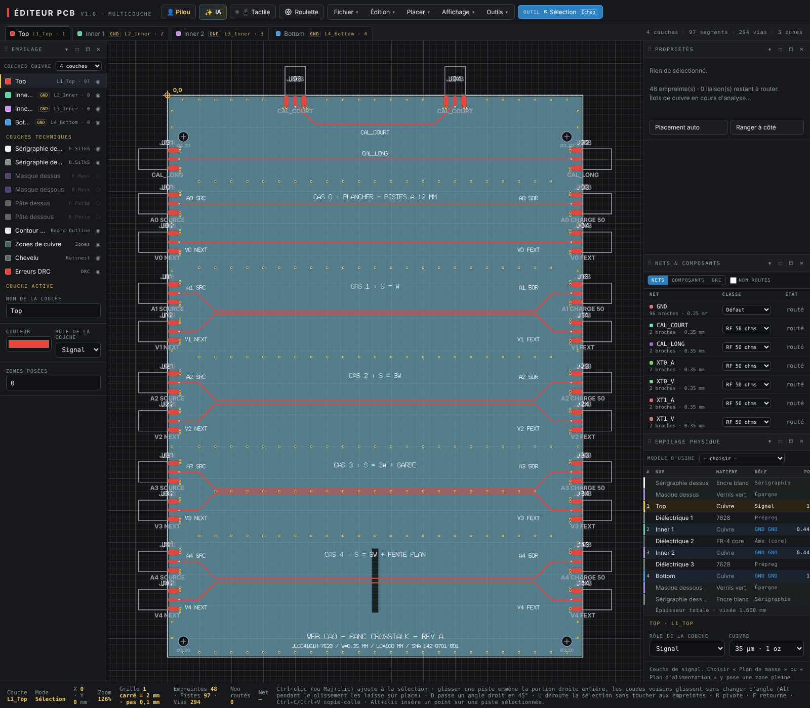

# Banc de mesure — crosstalk

Une carte d'essai à faire fabriquer, cinq couples agresseur / victime, et de quoi comparer **trois résultats** sur les mêmes cas :

1. **WEB_CAO** : l'onglet *Crosstalk* (niveau 2, `python/crosstalk.py`), par le même chemin que le bouton « Analyser la piste » ;
2. **ANSYS SIwave** : le *Crosstalk Scan* dans le domaine temporel, sur la même carte importée ;
3. **la mesure** : un générateur d'impulsions et un oscilloscope sur la carte réelle.

```
bancs-mesure/crosstalk/
  generer-carte.js          la carte, construite par le code de l'Éditeur PCB, puis DRC
  exporter-docs-sim.js      les documents de l'onglet Crosstalk, un par cas (Chromium)
  docs-sim/casN.json        ces documents, figés : le banc Python tourne sans navigateur
  sortie/banc-crosstalk-PCB.json   la carte générée (à ouvrir dans l'Éditeur PCB)
  banc-crosstalk-mesure.py  prévisions WEB_CAO + comparaison aux relevés
  releves.csv               à remplir : mesure et SIwave
```

Le projet correspondant (carte prête à ouvrir, notes de fabrication) est dans `WEB_SUITE_PROJETS/CAO/banc crosstalk/`.

---

## La carte



**130 × 176 mm, 4 couches, empilage JLCPCB JLC04161H-7628** (1,6 mm) :

| Couche | Rôle | Épaisseur |
|---|---|---|
| Top | les pistes, **et rien d'autre** (pas de cuivre coulé) | 35 µm |
| prépreg 7628 | εr 4,4 | 0,2104 mm |
| L2 | masse pleine | 15,2 µm |
| âme | εr 4,6 | 1,065 mm |
| L3 | masse pleine | 15,2 µm |
| prépreg 7628 | εr 4,4 | 0,2104 mm |
| Bottom | masse pleine + pattes des SMA | 35 µm |

- **Pistes de 0,35 mm** : environ 50 Ω en microruban vernis (MoM de WEB_CAO : 50,5 Ω avec 10 µm de vernis). Commander **avec contrôle d'impédance** (50 Ω, couche Top, référence L2) : JLC ajuste la largeur et donne son εr.
- **Longueur couplée : 100 mm**, pour environ 620 ps de retard. Le NEXT atteint son plateau avec les fronts jusqu'à 1,2 ns.
- **Embases SMA bord de carte** : Cinch / Johnson **142-0701-801**, la référence `CONN_Embase_SMA_CI_Bord_de_carte` de la LIB. Repère **J{cas}{port}** :

| Port | Repère | Rôle |
|---|---|---|
| 1 | J{n}1, gauche, haut | **source** de l'agresseur (générateur) |
| 2 | J{n}2, gauche, bas | victime côté source : **NEXT** |
| 3 | J{n}3, droite, haut | **charge** de l'agresseur (50 Ω), et mesure de son amplitude et de son front |
| 4 | J{n}4, droite, bas | victime côté charge : **FEXT** |

> [!WARNING]
> **Avant de commander, vérifiez l'empreinte de la SMA sur la datasheet de la 142-0701-801.** Ses cotes n'ont pas pu être relues sur le dessin du fabricant : elles sont regroupées en tête de `generer-carte.js` (`SMA = {…}` : retrait, longueur des pastilles, largeur de l'âme, entraxe et largeur des pattes de masse). Corrigez-les si besoin, puis relancez le générateur : toute la carte suit.

### Les cas

| Cas | Configuration | Ce qu'il teste | Ce qu'on attend |
|---|---|---|---|
| **0** | deux pistes à 12 mm, sans rapprochement | **le plancher de mesure** : connecteurs, câbles, masse du montage | tout ce qui sort ici est du bruit de montage, à retrancher en esprit des autres cas |
| **1** | microruban couplé, **S = W** = 0,35 mm | un couplage fort, bien mesurable | les trois sources d'accord, à l'εr près |
| **2** | microruban couplé, **S = 3W** = 1,05 mm | la règle des 3W, la sensibilité à l'écart | idem, à un niveau 5 fois plus bas |
| **3** | S = 3W, **piste de garde** de 0,35 mm au milieu, cousue tous les 5 mm | l'efficacité d'une garde | **cas 3 contre cas 2 = effet de la garde seule** |
| **4** | S = 3W, **fente de 2 mm** dans L2, L3 et Bottom, en travers des deux pistes au milieu du couplage | le couplage par le chemin de retour (impédance commune) | **cas 4 contre cas 2 = effet de la fente seule**. Un calcul 2D ne le voit pas |

Plus deux lignes d'étalonnage, de même largeur et avec les mêmes embases :
- **CAL_LONG** (J91 → J92, 126,50 mm) et **CAL_COURT** (J93 → J94, sur le bord du haut, 57,18 mm). La différence de longueur vaut **69,32 mm**. La différence de leurs retards mesurés donne l'**εr effectif réel**, connecteurs et câbles retranchés : `εeff = (c · Δt / 69,32 mm)²`. WEB_CAO attend environ 3,4, soit Δt ≈ 425 ps.

### Prévisions de WEB_CAO

`python bancs-mesure/crosstalk/banc-crosstalk-mesure.py` (rampe linéaire de durée t_r, sans pertes ; NEXT / FEXT en % de l'agresseur) :

| Cas | t_r 0,5 ns | 1 ns | 2,5 ns | 5 ns | 10 ns |
|---|---|---|---|---|---|
| 1 | 4,44 / 3,64 | 4,44 / 1,82 | 2,20 / 0,73 | 1,10 / 0,36 | 0,55 / 0,18 |
| 2 | 0,90 / 1,41 | 0,90 / 0,70 | 0,45 / 0,28 | 0,22 / 0,14 | 0,11 / 0,07 |
| 3 | 0,58 / 0,86 | 0,58 / 0,43 | 0,29 / 0,17 | 0,14 / 0,09 | 0,07 / 0,04 |
| 4 | 0,90 / 1,39 | 0,90 / 0,69 | 0,44 / 0,28 | 0,22 / 0,14 | 0,11 / 0,07 |

Avec 1 V sur l'agresseur, 0,1 % fait 1 mV. Les cas 2 à 4 demandent donc de **moyenner** (voir plus bas), et un front lent les fait vite descendre sous le plancher.

---

## Mesure à l'oscilloscope

### Matériel

- un générateur à sortie **50 Ω**, en mode impulsion ou carré, avec le **front le plus raide** qu'il sache faire ;
- un oscilloscope à **2 voies au moins**, avec entrée 50 Ω, ou à défaut une **traversée 50 Ω** (« feed-through » BNC) par voie ;
- des câbles SMA (ou SMA → BNC), **deux charges SMA 50 Ω**, et un adaptateur SMA femelle-femelle (pour mesurer les câbles seuls).

Bande passante : le temps de montée propre de l'oscilloscope (≈ 0,35 / BP) doit rester sous le tiers du front mesuré. Un oscilloscope de 200 MHz (1,75 ns) ne lit correctement que des fronts de plus de 5 ns.

### Montage, pour le cas n

**Les quatre ports sont toujours fermés sur 50 Ω.** Un port en l'air renvoie le NEXT dans le FEXT, et inversement.

| Port | Branché sur |
|---|---|
| J{n}1 | le générateur |
| J{n}3 | voie 1 (50 Ω) : amplitude et front 10-90 % de l'agresseur. Elle sert aussi de charge |
| J{n}2 | voie 2 (50 Ω) : NEXT |
| J{n}4 | voie 3 (50 Ω) : FEXT, ou une charge 50 Ω si l'oscilloscope n'a que 2 voies (on refait alors la mesure en permutant la voie 2 et la charge) |

Réglages :
- cadence basse (100 kHz à 1 MHz) : chaque front doit s'éteindre avant le suivant ;
- amplitude maximale du générateur ;
- **moyennage 64 à 256 coups** : sans cela, les cas 2 à 4 se noient dans le bruit ;
- déclenchement sur la voie 1.

Ce qu'on lit :
- **V_agresseur** : le palier sur J{n}3. **t_10_90** : son temps de montée ;
- **NEXT** : la crête sur J{n}2. Elle commence avec le front et dure environ 2 × 620 ps. Au-delà, ce sont les réflexions des embases du bout opposé ;
- **FEXT** : la crête (souvent négative) sur J{n}4, environ 620 ps après le départ. Prendre la valeur absolue.

Commencer par le **cas 0** : il donne le plancher. Si le cas 3 ne sort pas nettement au-dessus, le relevé n'est pas exploitable à ce front.

Reporter chaque relevé dans `releves.csv`, source `MESURE`.

---

## Crosstalk Scan dans SIwave

Les noms de menus changent d'une version à l'autre : ce qui suit donne **les réglages à reproduire**. Les intitulés exacts sont à retrouver dans votre version.

1. **Exporter la carte depuis WEB_CAO** : ouvrir le projet dans l'Éditeur PCB, *Fichier → Fabrication*. On obtient les Gerber (`.GTL`, `.GL2`, `.GL3`, `.GBL`), le perçage Excellon, le contour (`.GM1`), la netlist **IPC-D-356** (`.ipc`) et `EMPILAGE.txt`.
2. **Importer dans SIwave** (ou dans HFSS 3D Layout, puis ouvrir l'`.aedb` dans SIwave) par l'import Gerber, avec le perçage et la netlist IPC-356 pour retrouver les noms de nets (`XT1_A`, `XT1_V`… `GND`).
3. **L'empilage**, recopié de `EMPILAGE.txt` : Top 35 µm, 7628 0,2104 mm εr 4,4 tan δ 0,02, L2 15,2 µm, âme 1,065 mm εr 4,6, L3 15,2 µm, 7628 0,2104 mm, Bottom 35 µm, vernis 10 µm εr 3,8. Cuivre lisse : WEB_CAO calcule sans rugosité par défaut. **Une fois la carte reçue, remplacer les εr par ceux que JLC a mesurés, ou par l'εeff des lignes d'étalonnage**, dans les deux simulateurs.
4. **Les extrémités des nets** : déclarer un composant (ou un groupe de broches) sur la pastille d'âme de chaque SMA, avec `GND` en référence. Le **driver** est en J{n}1, les **récepteurs** en J{n}2, J{n}3 et J{n}4, tous en **50 Ω**.
5. **Le scan, dans le domaine temporel** : agresseurs `XT*_A`, victimes `XT*_V`, **Rise Time** égal au t_10_90 mesuré sur la carte, amplitude de la source (1 V sur 50 Ω, par exemple), impédances driver / récepteur de 50 Ω.
6. Relever pour chaque victime le **NEXT** (côté J{n}2) et le **FEXT** (côté J{n}4) en mV, et les reporter dans `releves.csv`, source `SIWAVE`, avec l'amplitude de la source sur 50 Ω dans `V_agresseur_mV`.

Le cas 4 est celui à regarder de près. Si le scan SIwave travaille, comme celui de WEB_CAO, sur des sections droites 2D le long des nets, il ne verra pas davantage la fente : seule la mesure, ou une extraction pleine onde (SIwave SYZ, HFSS), la chiffrera.

---

## Comparer

```bash
python bancs-mesure/crosstalk/banc-crosstalk-mesure.py            # tableau + comparaison
python bancs-mesure/crosstalk/banc-crosstalk-mesure.py --tr 2.5   # tableau à un front donné
```

Pour chaque relevé, WEB_CAO est recalculé **au front de ce relevé**, sous deux lectures :
- `t_r = t_10-90 / 0,8`, la rampe linéaire équivalente ;
- `t_r = t_10-90`, la borne haute du FEXT.

Le NEXT saturé n'en dépend pas, le FEXT varie de 25 % entre les deux. Le script donne l'écart en dB au milieu de la fourchette, et dit si le relevé y tombe (± 2 dB).

Ordre de lecture conseillé :
1. **les lignes d'étalonnage** : l'εeff mesuré contre 3,4. Un écart se reporte sur tout le reste : à corriger d'abord ;
2. **le cas 0** : le plancher ;
3. **les cas 1 et 2** : le moteur MoM et les formules du niveau 2. Les trois sources doivent s'accorder à 1 ou 2 dB près ;
4. **le cas 3 contre le cas 2** : ce que la garde retire. WEB_CAO prévoit −3,8 dB ;
5. **le cas 4 contre le cas 2** : ce que la fente ajoute. WEB_CAO ne prévoit rien (voir plus bas).

---

## Ce que le banc a déjà appris sur WEB_CAO

Avant même la fabrication, faire passer cette carte dans l'outil a mis au jour quatre comportements, à garder en tête en lisant les résultats :

1. **« Toute la carte » ignore la piste de garde.** La règle *diaphonie* de la vérification de carte (`analyse_carte`) rend pour le cas 3 exactement les chiffres du cas 2 (0,90 % / 0,70 % à 1 ns). « Analyser la piste » (`crosstalk.py`), lui, la prend en compte (0,58 % / 0,43 %).
2. **Le cas S = 3W tombe pile sur le seuil de présélection** (`3 × max(W, H)` = 1,05 mm) : « Analyser la piste » écarte le couple sans le chiffrer, sauf à ouvrir la *distance max* du panneau. Le banc la met à 3 mm.
3. **Une fente de moins de 1,5 mm sous la piste n'est pas vue.** La sonde du plan avance par pas de 0,5 mm et écarte tout trou plus court que 1,5 pas, qu'elle prend pour un dégagement d'antipad (`editeur-pcb/js/19-simulation.js`, `simXtFentes`). La fente du cas 4 a été portée à 2 mm pour être vue. Une fois vue, l'outil dit honnêtement qu'il ne calcule pas le couplage sur sa largeur. **Mais l'effet du détour du courant de retour n'est chiffré nulle part** : NEXT et FEXT restent ceux du cas 2.
4. **Une classe nommée « RF … » impose un front de 100 ps** (`tr_classes`) quand aucun front n'est saisi. Le FEXT du cas 1 sort alors à 18 %. Toujours saisir le front de la mesure.
